#目录
[TOC]
#作业
http://127.0.0.1:8000/monitor/performance/product

##第八次作业：

### 安装grapyite进行二次开发和管理
参考：http://graphite.readthedocs.io/en/latest/install.html
http://www.tuicool.com/articles/j6FBvq
####安装grapyite
```shell
[root@graphite-server ~]#  yum -y install epel-release

[root@graphite-server ~]# echo $LANG
de_DE.UTF-8
[root@graphite-server ~]# source /etc/sysconfig/i18n
[root@graphite-server ~]# echo $LANG
en_US.UTF-8
[root@graphite-server ~]# yum -y install graphite-web graphite-web-selinux mysql mysql-server MySQL-python

[root@graphite-server ~]# /etc/init.d/mysqld start

[root@graphite-server ~]# echo "/etc/init.d/mysqld start" >>/etc/rc.local
[root@graphite-server ~]# /usr/bin/mysql_secure_installation

[root@graphite-server ~]# exit
logout

[vagrant@graphite-server vagrant]$ mysql -uroot -proot1234

mysql> create database graphite;
Query OK, 1 row affected (0.00 sec)

mysql> grant all privileges on graphite.* to 'graphite'@'localhost' identified by '123456';
Query OK, 0 rows affected (0.00 sec)

mysql> flush privileges;
Query OK, 0 rows affected (0.00 sec)

mysql> exit
Bye
[vagrant@graphite-server vagrant]$ /usr/lib/python2.6/site-packages/graphite/manage.py syncdb

[root@graphite-server ~]# echo "/etc/init.d/httpd start">>/etc/rc.local 
[root@graphite-server ~]# yum -y install python-carbon python-whisper

[root@graphite-server ~]# /etc/init.d/carbon-cache start
Starting carbon-cache: Starting carbon-cache (instance a)
                                                           [  OK  ]
[root@graphite-server ~]# echo "/etc/init.d/carbon-cache start">>/etc/rc.local 
[root@graphite-server ~]# yum install nc
```


###删除临时测试用的whisper
```shell
[vagrant@graphite-server ~]$  cd /var/lib/carbon/whisper
[vagrant@graphite-server whisper]$ ls
carbon  reboot-devops-02  reboot-ms-web-01  test.wsp  zabbix-server-01
[vagrant@graphite-server whisper]$ rm -rf test.wsp 
rm: cannot remove `test.wsp': Permission denied
[vagrant@graphite-server whisper]$ sudo rm -rf test.wsp 
[vagrant@graphite-server whisper]$ 

```

##测试：
+ 启动vagrant
    - sublime 左栏Lesson03目录，右键“Open Glue Terminal”
    - vagrant up default
    - 注：因为是听到第五次课时，回头补上的第四次作业，所以vagrant虚拟机多了几个，此时启动要加上指定vm，此处是default
    - 同理，关闭vm也是 vagrant halt default
+ 启动MySQL
    - ssh 127.0.0.1 2222
    - sudo /etc/init.d/mysqld start
+ 启动webserver
    - ssh 127.0.0.1 2222
    - cd /vagrant
    - python manage.py runserver -h 0.0.0.0 -p 8000
+ 打印日志
    - 复制ssh隧道
    - cd /vagrant 
    - tail -f flask.log
##zabbix
+ 启动MySQL sudo /etc/init.d/mysqld start
+ 启动server sudo service zabbix-server start
+ 启动web管理界面 sudo /etc/init.d/httpd start

+ 启动agent    sudo service zabbix-agent start
+ 访问web管理 http://192.168.99.14/zabbix/
    - Admin/zabbix
+ 重启web sudo service httpd restart

##进度
+ cmdb
    + 首页： http://127.0.0.1:8000/dashboard/
    + IT资产-->IDC信息：  http://127.0.0.1:8000/resources/idc/ 
        - 列表，添加、修改、删除
    + IT资产-->服务器：  列表 http://127.0.0.1:8000/resources/server/list/
            - 添加页面 http://127.0.0.1:8000/resources/server/add/
            - 修改页面 http://127.0.0.1:8000/resources/server/modify/1
    + 修正server_edit.html模块的缺陷：如果不变更 制造商字段时，提交manufacturers空数据；
    + 修正models.py中的DB表定义：idc，server，cabinet中的idc.id字段由字符串改为整型；并修订对应模版缺陷；
    + 变更字段类型时，需先注释掉该字段，migrate & upgrade，然后加上修改后的字段，migrate & upgrade；最后登录数据库维护该字段即可；
    + 在modules的__init__.py中定义BaseDao类，将对各个模块的CRUD抽象封装；使用时只需传入对应的表models类即可
    + 其实让各模块操作类继承BaseDao最好，但是这么做就需要修订JsonRPC调用代码：得声明类对象。暂保持与大家代码的兼容；
+ 监控和zabbix
    + 采集监控信息 /test/collector/sysinfo.py
    + 测试zabbix，get版本信息 /test/testzabbix.py
    + 上报采集到的信息 /test/collector/sysinfo.py 
        + url = "http://192.168.99.10:8000/resources/server/reporting/"
+ 未全部完成 作业1：批量创建主机，加入新建的network组，并指定模版
    + test/test_zabbix_host_and_group.py
    + 指定模版  Template SNMP Device 时报错，暂未能处理
        + response的内容：{"jsonrpc":"2.0","error":{"code":-32602,"message":"Invalid params.","data":"Cannot find host interface on \"juniper-device-01\" for item key \"ifDescr\"."},"id":1}
    + 指定普通模版 Reboot_template 没问题  
+ 完成 作业2： 将zb里的host同步缓存表(zb_host) 
    + http://127.0.0.1:8000/test_zabbix
+ 完成 作业3： 将CMDB里的信息同步到缓存表里
    + http://127.0.0.1:8000/test_zabbix
+ 完成 第六次作业：一批机器突然故障，运维已知， 想要关掉报警， 但不能关数据采集
    + 简单demo测试： test/test_zabbix_maintenance.py
+ 未完成 作业7：实现一个简单的中文分词搜索
+ 完成 第八次课堂作业8：监控和graphite展示
    + graphite_key维护 http://127.0.0.1:8000/monitor/graphite/keys/
    + graphite_group管理 http://127.0.0.1:8000/monitor/graphite/groups/
    + graphite_性能展示 http://127.0.0.1:8000/monitor/performance/product
    + 已知问题：monitor/graphite/groups/用户点击产品线时 select_options.multiSelect('deselect', seclect_host) 会触发调用 afterDeselect，弹出添加错误；修复方向：初始化select时，换一个不调用deselect的方法 -- 暂未处理
+ 为已经实现的功能做了截图：

    + dashboard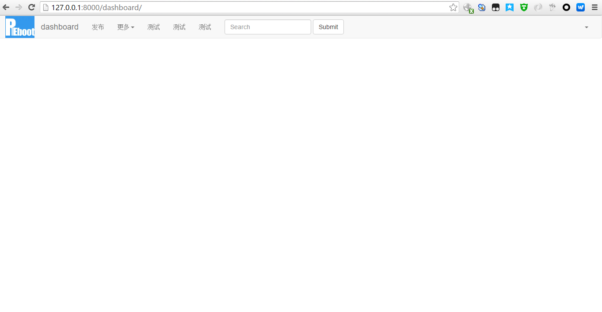
    + resource_server_list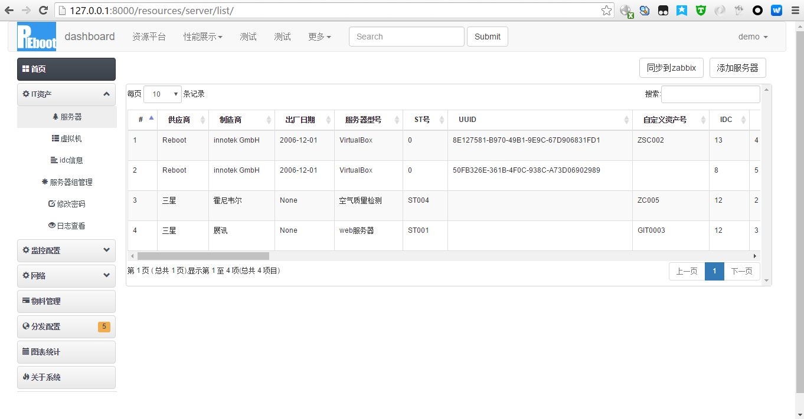
    + resources_idc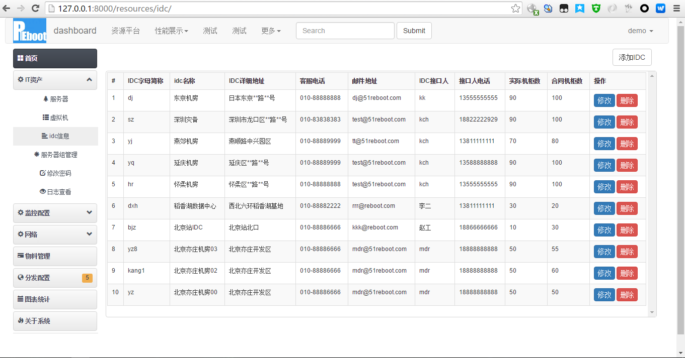
    + resources_idc_add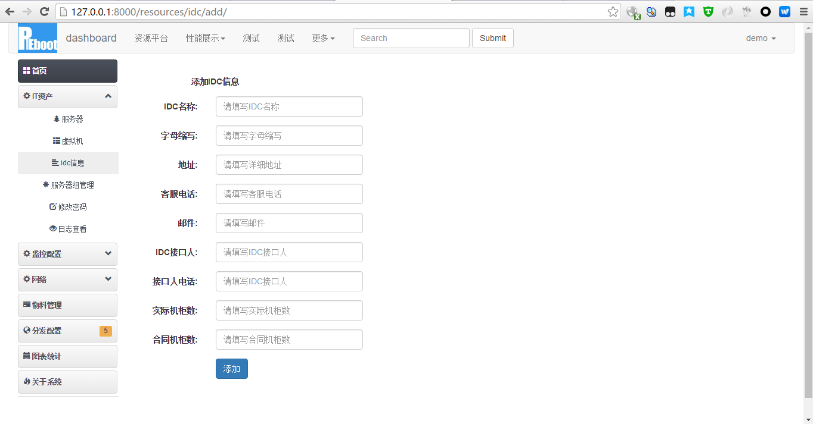
    + resources_server_modify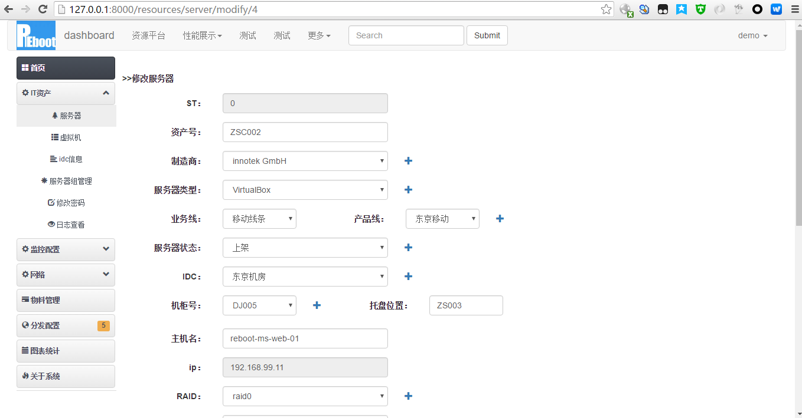
    + resources_server_add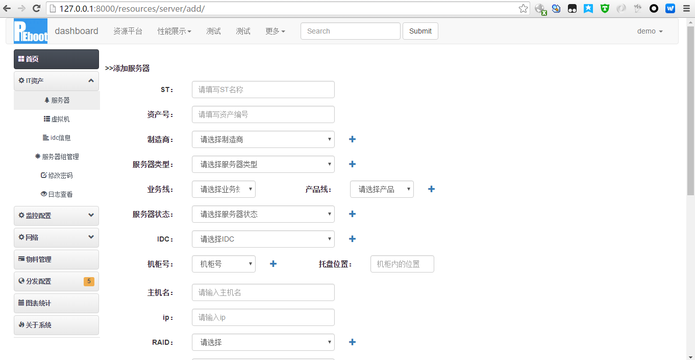
    + resources_server_2_zabbix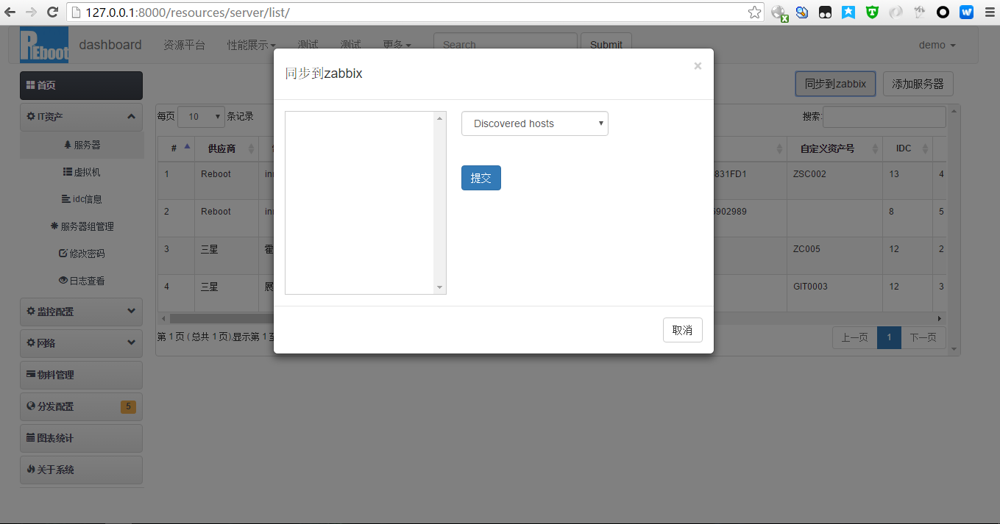
    + zabbix_模版绑定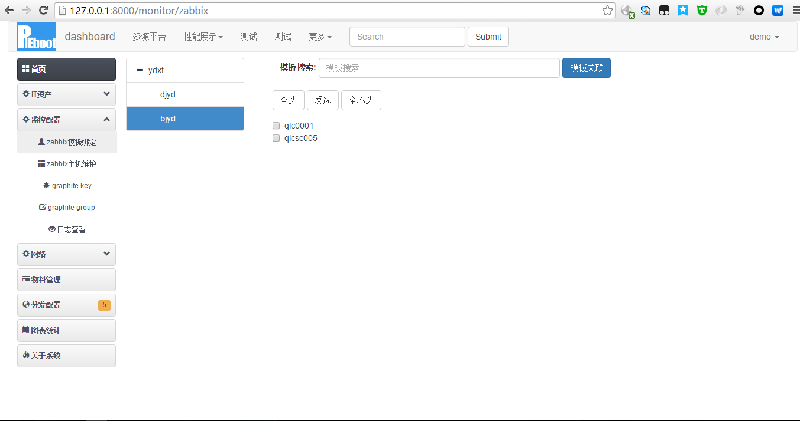
    + graphite_key维护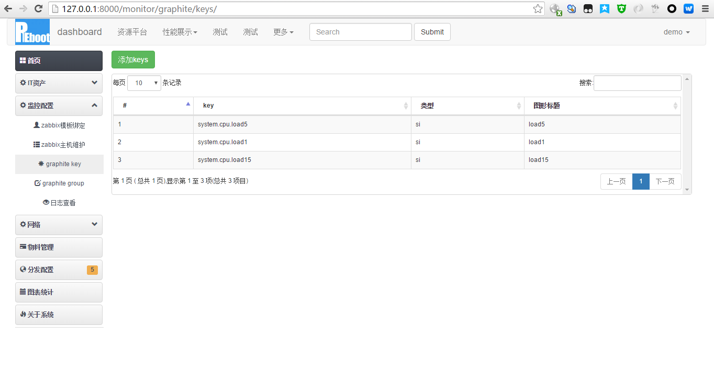
    + graphite_group管理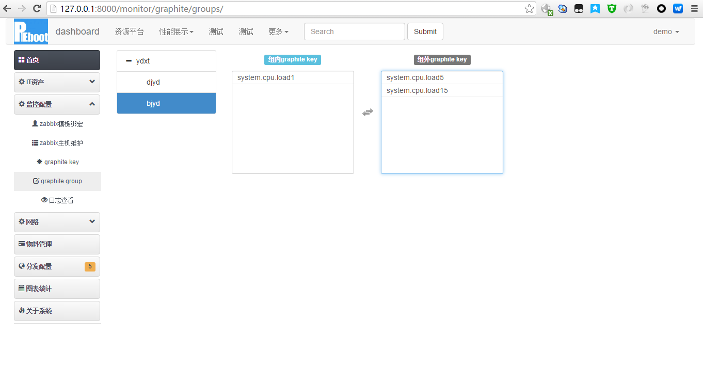
    + graphite_性能展示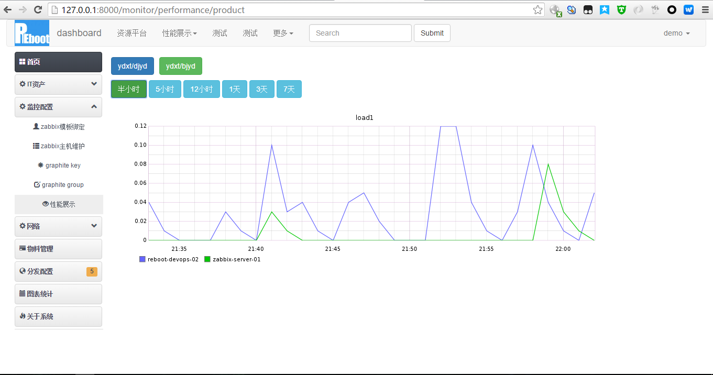
    + graphite_性能展示02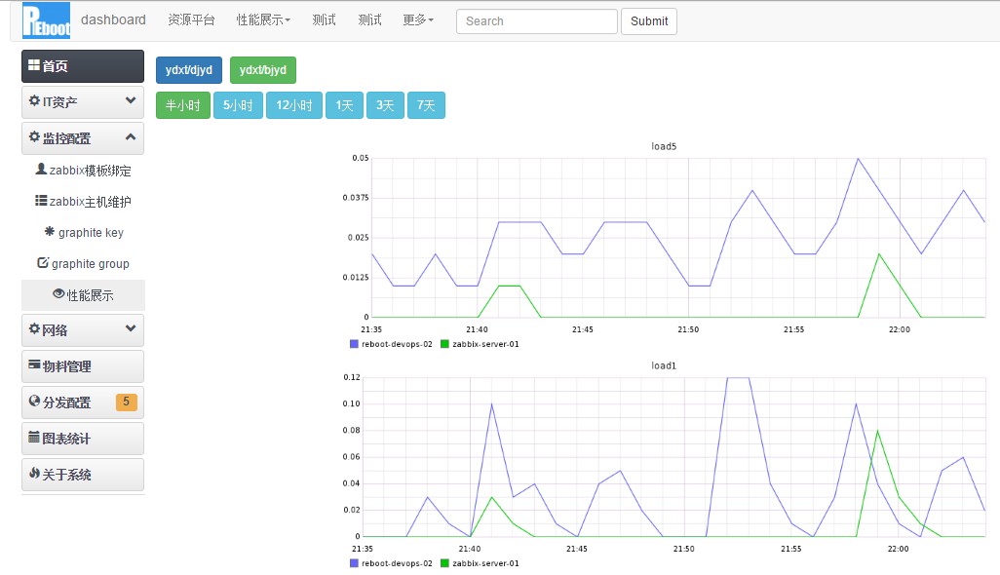
    + graphite_server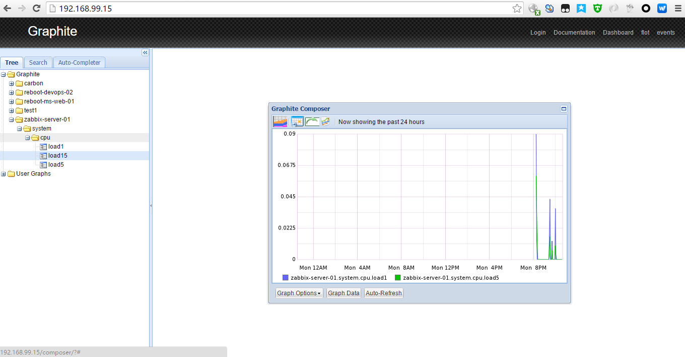


# 在cmdb服务器安装插件
pip install zabbix-client -i https://pypi.doubanio.com/simple/


##其他开发日志：
###AssertionError: View function mapping is overwriting an existing endpoint function: main.resources_idc_modify
原因：app/main下对应的路由函数有重名
###Zabbix server is not running:the information displayed may not be current.
原因：明明是启动了的。是Selinx没有关闭，关掉即可；
##需要注意的地方
centos6.5关闭selinux、iptables、ipv6
http://blog.chinaunix.net/xmlrpc.php?r=blog/article&uid=29302591&id=4829027
1、关闭selinux
/usr/sbin/setenforce 0 立刻关闭selinux
/usr/sbin/getenforce 1 立刻开启selinux
永久更改
vim /etc/selinux/config
#SELINUX=enforcing
#SELINUXTYPE=targeted
SELINUX=disabled
重启系统
2、关闭防火墙
/sbin/iptables -I INPUT -p tcp --dport 80 -j ACCEPT
/sbin/iptables -I INPUT -p tcp --dport 22 -j ACCEPT
/etc/rc.d/init.d/iptables save
永久性关闭防火墙：
#chkconfig --level 35 iptables off (注意中间的是两个英式小短线;重启)
3、关闭ipv6
1）、vim /etc/sysconfig/network     追加
NETWORKING_IPV6=no
2）、vim /etc/hosts
#::1    localhost localhost6 localhsot6.localdomai6
3）、新建/etc/modprobe/ipv6off.conf文件（名字随便取）
添加内容
alias net-pf-10 off
options ipv6 disable=1

##输出
### 采集监控信息
```shell

```
### 测试zabbix
```shell
(python27env) [vagrant@reboot-ms-web-01 test]$ python test_zabbix_maintenance.py 
======发送正常数据测试zabbix返回执行结果：======
response的状态：200
response的内容：{"jsonrpc":"2.0","result":{"maintenanceids":["3"]},"id":1}
创建的maintenance id为：3
(python27env) [vagrant@reboot-ms-web-01 test]$ 

```
###webserver端输出
```shell


```
###日志输出
```shell


```
###mysql输出
```sql


```

##笔记
