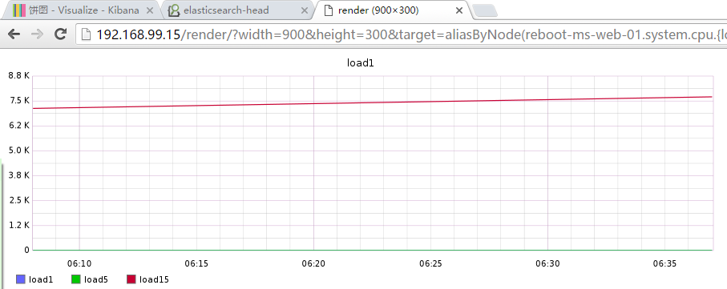
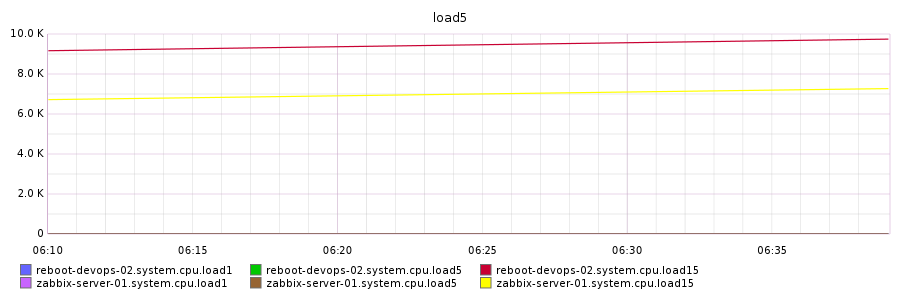

#目录
[TOC]

# API demo

+ test/carbon.py:通过socket创建metric

#自动化发布
##约不约:目录结构存放规范
reboot/web/
reboot/script/
reboot/script/python
reboot/script/python/app/monitor/
reboot/script/php
reboot/script/bash

#通配符解决URL长度问题
http://192.168.99.15/render/?width=900&height=300&target=reboot-devops-02.system.cpu.{load1,load5,load15}&target=zabbix-server-01.system.cpu.{load1,load5,load15}&target=graphite-server.system.cpu.{load1,load5,load15}&yUnitSystem=si&title=load5&from=-30min&t=1468117220614

http://192.168.99.15/render/?width=900&height=300&target=aliasByNode(reboot-ms-web-01.system.cpu.{load1,load5,load15},3)&yUnitSystem=si&title=load1&from=-30min&t=1468116225736

graphite_正则URL

#graphite api文档
http://graphite-api.readthedocs.io/en/latest/api.html#graphing-metrics

#小练习
http://192.168.99.15/render/?width=900&height=300&target=reboot-devops-02.system.cpu.{load1,load5,load15}&target=zabbix-server-01.system.cpu.{load1,load5,load15}&target=graphite-server.system.cpu.{load1,load5,load15}&yUnitSystem=si&title=load5&from=-30min&t=1468117220614

graphite_demo

##去的第8天到过去的第7天这一天的数据
&from=-8d&until=-7d
(shows same day last week)

&from=04:00_20110501&until=16:00_20110501
(shows 4AM-4PM on May 1st, 2011)
##看历史数据
    2006-10-01 8:00   ~ 2015-3-21 18:50

2006-10-01 8:00   ~ 2015-3-21 18:50
http://192.168.99.15/render/?width=900&height=300&target=aliasByNode(reboot-ms-web-01.system.cpu.{load1,load5,load15},3)&yUnitSystem=si&title=load1&
from=08:00_20061001&until=18:50_20160710

