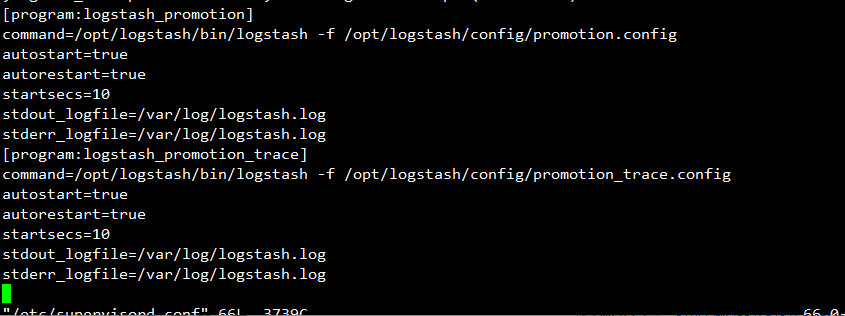
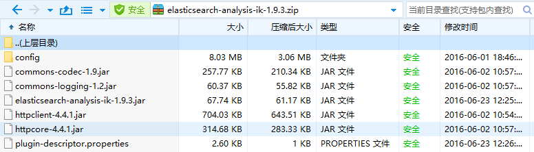

[TOC]
#ES使用Demo
## 使用ES自带的中文分词插件 VS 不使用中文分词 ： post
```shell
curl -XPOST http://127.0.0.1:9200/_analyze/?pretty -d '{
"analyzer": "smartcn",                                                                                         
"text": "联想是全球最大的笔记本厂商"
}'
```

```shell
curl -XPOST http://127.0.0.1:9200/_analyze/?pretty -d '{
"text": "联想是全球最大的笔记本厂商"
}'
```
## result：

```shell
[es@bogon bin]$  curl -XPOST http://127.0.0.1:9200/_analyze/?pretty -d '{
> "analyzer": "smartcn",                                                                                         
> "text": "联想是全球最大的笔记本厂商"
> }'
{
  "tokens" : [ {
    "token" : "联想",
    "start_offset" : 0,
    "end_offset" : 2,
    "type" : "word",
    "position" : 0
  }, {
    "token" : "是",
    "start_offset" : 2,
    "end_offset" : 3,
    "type" : "word",
    "position" : 1
  }, {
    "token" : "全球",
    "start_offset" : 3,
    "end_offset" : 5,
    "type" : "word",
    "position" : 2
  }, {
    "token" : "最",
    "start_offset" : 5,
    "end_offset" : 6,
    "type" : "word",
    "position" : 3
  }, {
    "token" : "大",
    "start_offset" : 6,
    "end_offset" : 7,
    "type" : "word",
    "position" : 4
  }, {
    "token" : "的",
    "start_offset" : 7,
    "end_offset" : 8,
    "type" : "word",
    "position" : 5
  }, {
    "token" : "笔记本",
    "start_offset" : 8,
    "end_offset" : 11,
    "type" : "word",
    "position" : 6
  }, {
    "token" : "厂商",
    "start_offset" : 11,
    "end_offset" : 13,
    "type" : "word",
    "position" : 7
  } ]
}
[es@bogon bin]$ curl -XPOST http://127.0.0.1:9200/_analyze/?pretty -d '{
> "text": "联想是全球最大的笔记本厂商"
> }'
{
  "tokens" : [ {
    "token" : "联",
    "start_offset" : 0,
    "end_offset" : 1,
    "type" : "<IDEOGRAPHIC>",
    "position" : 0
  }, {
    "token" : "想",
    "start_offset" : 1,
    "end_offset" : 2,
    "type" : "<IDEOGRAPHIC>",
    "position" : 1
  }, {
    "token" : "是",
    "start_offset" : 2,
    "end_offset" : 3,
    "type" : "<IDEOGRAPHIC>",
    "position" : 2
  }, {
    "token" : "全",
    "start_offset" : 3,
    "end_offset" : 4,
    "type" : "<IDEOGRAPHIC>",
    "position" : 3
  }, {
    "token" : "球",
    "start_offset" : 4,
    "end_offset" : 5,
    "type" : "<IDEOGRAPHIC>",
    "position" : 4
  }, {
    "token" : "最",
    "start_offset" : 5,
    "end_offset" : 6,
    "type" : "<IDEOGRAPHIC>",
    "position" : 5
  }, {
    "token" : "大",
    "start_offset" : 6,
    "end_offset" : 7,
    "type" : "<IDEOGRAPHIC>",
    "position" : 6
  }, {
    "token" : "的",
    "start_offset" : 7,
    "end_offset" : 8,
    "type" : "<IDEOGRAPHIC>",
    "position" : 7
  }, {
    "token" : "笔",
    "start_offset" : 8,
    "end_offset" : 9,
    "type" : "<IDEOGRAPHIC>",
    "position" : 8
  }, {
    "token" : "记",
    "start_offset" : 9,
    "end_offset" : 10,
    "type" : "<IDEOGRAPHIC>",
    "position" : 9
  }, {
    "token" : "本",
    "start_offset" : 10,
    "end_offset" : 11,
    "type" : "<IDEOGRAPHIC>",
    "position" : 10
  }, {
    "token" : "厂",
    "start_offset" : 11,
    "end_offset" : 12,
    "type" : "<IDEOGRAPHIC>",
    "position" : 11
  }, {
    "token" : "商",
    "start_offset" : 12,
    "end_offset" : 13,
    "type" : "<IDEOGRAPHIC>",
    "position" : 12
  } ]
}
[es@bogon bin]$ 

```
ES系统自带的smartcn中文分词插件，在分词结果过滤方面基本上等于没有。比如上述例子中的“是”之类助词没有过滤；
业界比较好的中文分词器是IK

## cat常用接口：查看ES信息
查看帮助
/_cat/? 

```shell
[es@bogon bin]$ curl http://127.0.0.1:9200/_cat/?
=^.^=
/_cat/allocation
/_cat/shards
/_cat/shards/{index}
/_cat/master
/_cat/nodes
/_cat/indices
/_cat/indices/{index}
/_cat/segments
/_cat/segments/{index}
/_cat/count
/_cat/count/{index}
/_cat/recovery
/_cat/recovery/{index}
/_cat/health
/_cat/pending_tasks
/_cat/aliases
/_cat/aliases/{alias}
/_cat/thread_pool
/_cat/plugins
/_cat/fielddata
/_cat/fielddata/{fields}
/_cat/nodeattrs
/_cat/repositories
/_cat/snapshots/{repository}
[es@bogon bin]$ 

[es@bogon bin]$ curl http://127.0.0.1:9200/_cat/count
1469011102 18:38:22 37536 
[es@bogon bin]$ curl http://127.0.0.1:9200/_cat/health
1469013309 19:15:09 elasticsearch yellow 1 1 16 16 0 0 11 0 - 59.3% 
[es@bogon bin]$ curl http://127.0.0.1:9200/_cat/indices
yellow open logstash-nginxjson-2016.06.25 5 1 37520 0  2.9mb  2.9mb 
yellow open panda                         5 1     6 0 24.4kb 24.4kb 
yellow open .kibana                       1 1     9 0 48.1kb 48.1kb 
green  open baike                         5 0     1 0  6.7kb  6.7kb 
[es@bogon bin]$ curl http://127.0.0.1:9200/_cat/nodes
10.0.2.15 10.0.2.15 11 77 0.00 d * Yukio 
[es@bogon bin]$ 
```
## 使用sence插件往ES提交数据进行测试

### logstash 读取参数文件 

```shell
input{
  file {
    path => "/usr/local/logstash-2.2.0/conf.d/access.json"
    type => "nginxjson"
    codec => "json"
    start_position => "beginning" 
   }
}
output {
    stdout{
     codec=>rubydebug
    }
    elasticsearch {
      hosts => ["127.0.0.1:9200"]
      index => "logstash-%{type}-%{+YYYY.MM.dd}"
      document_type => "nginx"
      workers => 1
   } 
}
```
### 执行读取

命令 | 注释
----|----
cd /usr/local/logstash-2.2.0 | 进入Logstash所在目录，注意切换用户
rm -rf ~/.sincedb_*   | 删除所有测试的已读取记录，生产上不能这么操作
./bin/logstash -f conf.d/ngnix.conf -t  | 测试配置文件
./bin/logstash -f conf.d/ngnix.conf  | 执行读取配置文件，启动Logstash 

生产环境中，不会直接敲命令运行，一般配合Supervisor守护进程使用；
20160720193650Supervisor配置模版


# 安装ES的IK中文分词插件
注意，需安装配置Java包管理的maven环境和源码管理的git环境；
## maven 安装配置

+ 下载 并解压缩到比如D盘 http://maven.apache.org/download.cgi
+ 配置环境变量MAVEN_HOME 

```shell
D:\maven\apache-maven-3.3.9\
```
+ 编辑环境变量PATH，新增 

```shell
;%MAVEN_HOME%\bin
```

## 手动编译

```shell
git clone https://github.com/medcl/elasticsearch-analysis-ik
cd elasticsearch-analysis-ik
mvn clean
mvn compile
mvn package
```

## 安装
copy & unzip file #{project_path}/elasticsearch-analysis-ik/target/releases/elasticsearch-analysis-ik-*.zip to your elasticsearch's folder: plugins/ik
重启 elasticsearch即可

## IK编译后截图：
20160720195923_IK编译后结果截图


## 分词器配置
转自： http://my.oschina.net/xiaohui249/blog/232784
打开ES_HOME/config/elasticsearch.yml文件，在文件最后加入如下内容：

```shell
index:
  analysis:                   
    analyzer:      
      ik:
          alias: [ik_analyzer]
          type: org.elasticsearch.index.analysis.IkAnalyzerProvider
      ik_max_word:
          type: ik
          use_smart: false
      ik_smart:
          type: ik
          use_smart: true
index.analysis.analyzer.default.type: ik
```

    ok！插件安装已经完成，请重新启动ES，接下来测试ik分词效果啦！

## ik分词测试

### 创建一个索引，名为index。   

```shell
curl -XPUT http://localhost:9200/index
```

### 为索引index创建mapping

```shell

curl -XPOST http://localhost:9200/index/fulltext/_mapping -d'
{
    "fulltext": {
             "_all": {
            "analyzer": "ik"
        },
        "properties": {
            "content": {
                "type" : "string",
                "boost" : 8.0,
                "term_vector" : "with_positions_offsets",
                "analyzer" : "ik",
                "include_in_all" : true
            }
        }
    }
}'
```

### 测试

```shell
curl 'http://localhost:9200/index/_analyze?analyzer=ik&pretty=true' -d '
{
"text":"世界那么大,我想去看看。"
}'
```

### 显示结果如下：

```shell
{
  "tokens" : [ {
    "token" : "世界",
    "start_offset" : 0,
    "end_offset" : 2,
    "type" : "CN_WORD",
    "position" : 0
  }, {
    "token" : "那么大",
    "start_offset" : 2,
    "end_offset" : 5,
    "type" : "CN_WORD",
    "position" : 1
  }, {
    "token" : "那么",
    "start_offset" : 2,
    "end_offset" : 4,
    "type" : "CN_WORD",
    "position" : 2
  }, {
    "token" : "么",
    "start_offset" : 3,
    "end_offset" : 4,
    "type" : "CN_WORD",
    "position" : 3
  }, {
    "token" : "大",
    "start_offset" : 4,
    "end_offset" : 5,
    "type" : "CN_CHAR",
    "position" : 4
  }, {
    "token" : "我",
    "start_offset" : 6,
    "end_offset" : 7,
    "type" : "CN_CHAR",
    "position" : 5
  }, {
    "token" : "想去",
    "start_offset" : 7,
    "end_offset" : 9,
    "type" : "CN_WORD",
    "position" : 6
  }, {
    "token" : "去看",
    "start_offset" : 8,
    "end_offset" : 10,
    "type" : "CN_WORD",
    "position" : 7
  }, {
    "token" : "看看",
    "start_offset" : 9,
    "end_offset" : 11,
    "type" : "CN_WORD",
    "position" : 8
  } ]
}
```