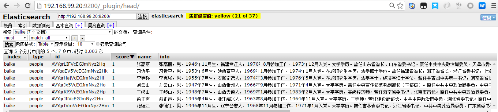
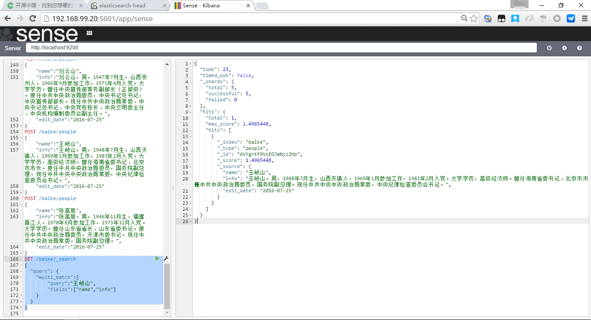
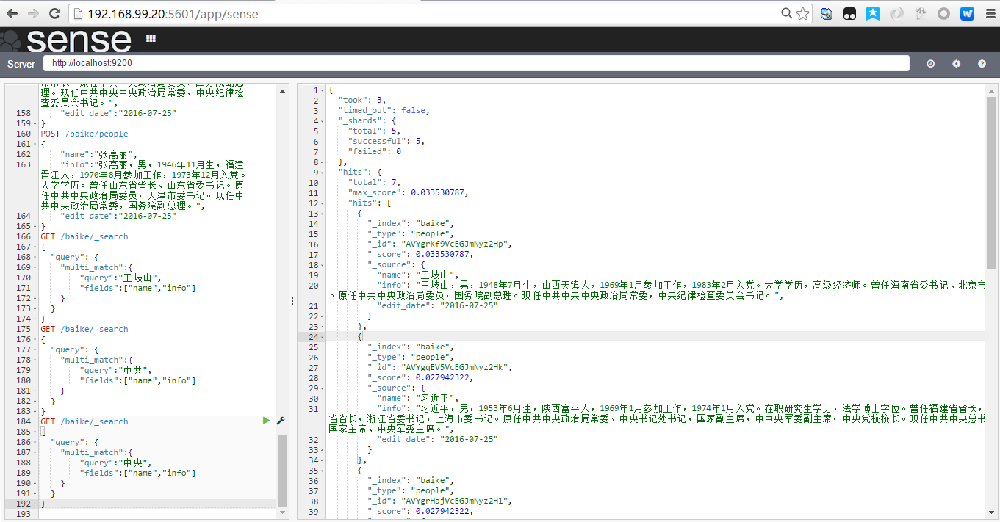

[TOC]
# 02-mapping操作

+ mapping的两个作用：
    + 定义数据表每列的数据类型   
    + 设置每个字段的analysis方式
+ ES和传统数据库类比

+ 关系型数据集（MySQL）|非关系型数据库（Elasticsearch）
----|----
数据库Database|索引Index
表Table|类型Type
数据行Row|文档Document
数据列Column|字段Field

+ 启动ES

```shell
[es@elk-01 ~]$ cd /usr/local/elasticsearch-2.2.0/
[es@elk-01 elasticsearch-2.2.0]$ ./bin/elasticsearch -d
[es@elk-01 elasticsearch-2.2.0]$
+ 启动kibana：vagrant用户
```

+ 访问ES
    + http://192.168.99.20:9200/
    + http://192.168.99.20:9200/_plugin/head/

```shell

[vagrant@elk-01 ~]$ sudo /usr/local/kibana-4.4.0-linux-x64/bin/kibana
  log   [10:03:23.745] [info][status][plugin:sense] Status changed from uninitialized to green - Ready
  log   [10:03:23.754] [info][status][plugin:kibana] Status changed from uninitialized to green - Ready
  log   [10:03:23.792] [info][status][plugin:elasticsearch] Status changed from uninitialized to yellow - Waiting for Elasticsearch
  log   [10:03:23.819] [info][status][plugin:kbn_vislib_vis_types] Status changed from uninitialized to green - Ready
  log   [10:03:23.832] [info][status][plugin:markdown_vis] Status changed from uninitialized to green - Ready
  log   [10:03:23.839] [info][status][plugin:metric_vis] Status changed from uninitialized to green - Ready
  log   [10:03:23.865] [info][status][plugin:spyModes] Status changed from uninitialized to green - Ready
  log   [10:03:23.875] [info][status][plugin:statusPage] Status changed from uninitialized to green - Ready
  log   [10:03:23.901] [info][status][plugin:table_vis] Status changed from uninitialized to green - Ready
  log   [10:03:23.974] [info][status][plugin:elasticsearch] Status changed from yellow to green - Kibana index ready
  log   [10:03:23.977] [info][listening] Server running at http://0.0.0.0:5601

```

+ 访问kibana
    + http://192.168.99.20:5601/
    + http://192.168.99.20:5601/app/sense

## 查询、删除索引


+ GET /baike/_mapping  # 查询索引

```json
{
  "baike": {
    "mappings": {
      "people": {
        "properties": {
          "edit_date": {
            "type": "date",
            "format": "yyyy-MM-dd"
          },
          "info": {
            "type": "string",
            "analyzer": "ik"
          },
          "name": {
            "type": "string",
            "analyzer": "ik"
          }
        }
      }
    }
  }
}
```

+ DELETE /baike  #删除索引
+ 输出

```json
  "acknowledged": true
}
```
## 创建索引并定义数据类型
```shell
PUT /baike
{
  "settings": {
        "number_of_shards": 5,
        "number_of_replicas": 0
  },  
  "mappings": {
      "people": {
        "properties": {
          "name": {
            "type": "string",
            "search_analyzer": "ik",
            "analyzer": "ik"          
        },  
          "info": {
            "type": "string",            
            "analyzer": "ik",
            "search_analyzer": "ik"
          },  
          "edit_date":{
            "type": "date",
            "format": "yyyy-MM-dd"
          }   
        }   
      }   
    }   
}
```
+ 输出
```json
{
  "acknowledged": true
}
```


## 查看mapping是否存在
### 默认查询
```shell
[es@elk-01 ~]$ curl http://127.0.0.1:9200/baike/_mapping
{"baike":{"mappings":{"people":{"properties":{"edit_date":{"type":"date","format":"yyyy-MM-dd"},"info":{"type":"string","analyzer":"ik"},"name":{"type":"string","analyzer":"ik"}}}}}}
```

### 优化查询显示

```shell
[es@elk-01 ~]$ curl http://127.0.0.1:9200/baike/_mapping?pretty
{
  "baike" : {
    "mappings" : {
      "people" : {
        "properties" : {
          "edit_date" : {
            "type" : "date",
            "format" : "yyyy-MM-dd"
          },
          "info" : {
            "type" : "string",
            "analyzer" : "ik"
          },
          "name" : {
            "type" : "string",
            "analyzer" : "ik"
          }
        }
      }
    }
  }
}
```

## 通过sence插件插入数据

```shell
POST /baike/people
{
    "name":"习近平",
    "info":"习近平，男，1953年6月生，陕西富平人，1969年1月参加工作，1974年1月入党。在职研究生学历，法学博士学位。曾任福建省省长，浙江省省长，浙江省委书记，上海市委书记。原任中共中央政治局常委、中央书记处书记，国家副主席，中中央军委副主席，中央党校校长。现任中共中央总书记、国家主席、中央军委主席。",
    "edit_date":"2016-07-25"
}
POST /baike/people
{
    "name":"李克强",
    "info":"李克强，男，1955年7月生，安徽定远人，1974年3月参加工作，1976年5月入党。在职研究生学历，法学学士、经济学博士学位。曾任共青团中央第一书记，河南省省长，河南省委书记，辽宁省委书记。原任中共中央政治局常委，国务院副总理。现任中共中央政治局常委，国务院总理。",
    "edit_date":"2016-07-25"
}
POST /baike/people
{
    "name":"张德江",
    "info":"张德江，男，1946年11月生，辽宁台安人，1968年11月参加工作，1971年1月入党。大学学历。曾任吉林省委书记，浙江省委书记，中共中央政治局委员、广东省委书记。原任中共中央政治局委员，国务院副总理，重庆市委书记。现任中共中央政治局常委，全国人大常委会委员长。",
    "edit_date":"2016-07-25"
}
POST /baike/people
{
    "name":"俞正声",
    "info":"俞正声，男，1945年4月生，浙江绍兴人，1963年8月参加工作，1964年11月入党。大学学历，工程师。曾任建设部部长，中共中央政治局委员、湖北省委书记。原任中共中央政治局委员，上海市委书记。现任中共中央政治局常委，全国政协主席。",
    "edit_date":"2016-07-25"
}
POST /baike/people
{
    "name":"刘云山",
    "info":"刘云山，男，1947年7月生，山西忻州人，1966年9月参加工作，1971年4月入党。大学学历。曾任中央宣传部常务副部长（正部级）。原任中共中央政治局委员，中央书记处书记，中央宣传部部长。现任中共中央政治局常委、中央书记处书记、中央党校校长、中央文明委主任、中央机构编制委员会副主任。",
    "edit_date":"2016-07-25"
}
POST /baike/people
{
    "name":"王岐山",
    "info":"王岐山，男，1948年7月生，山西天镇人，1969年1月参加工作，1983年2月入党。大学学历，高级经济师。曾任海南省委书记、北京市市长。原任中共中央政治局委员，国务院副总理。现任中共中央中央政治局常委，中央纪律检查委员会书记。",
    "edit_date":"2016-07-25"
}
POST /baike/people
{
    "name":"张高丽",
    "info":"张高丽，男，1946年11月生，福建晋江人，1970年8月参加工作，1973年12月入党。大学学历。曾任山东省省长、山东省委书记。原任中共中央政治局委员，天津市委书记。现任中共中央政治局常委，国务院副总理。",
    "edit_date":"2016-07-25"
}
```

20160725142820_mapping_创建索引插入数据
### 通过命令行插入 例子
```shell
curl -XPOST http://127.0.0.1:9200/baike/people?pretty -d '{
    "name":"张高丽",
    "info":"张高丽，男，1946年11月生，福建晋江人，1970年8月参加工作，1973年12月入党。大学学历。曾任山东省省长、山东省委书记。原任中共中央政治局委员，天津市委书记。现任中共中央政治局常委，国务院副总理。",
    "edit_date":"2016-07-25"
}
```


## 搜索
### 通过sence查
```shell
GET /baike/_search
{
  "query": {
    "multi_match":{
        "query":"王岐山",
        "fields":["name","info"]
    }
  }
}
```

#### 查询结果

```json
{
  "took": 23,
  "timed_out": false,
  "_shards": {
    "total": 5,
    "successful": 5,
    "failed": 0
  },
  "hits": {
    "total": 1,
    "max_score": 1.4965448,
    "hits": [
      {
        "_index": "baike",
        "_type": "people",
        "_id": "AVYgrKf9VcEGJmNyz2Hp",
        "_score": 1.4965448,
        "_source": {
          "name": "王岐山",
          "info": "王岐山，男，1948年7月生，山西天镇人，1969年1月参加工作，1983年2月入党。大学学历，高级经济师。曾任海南省委书记、北京市市长。原任中共中央政治局委员，国务院副总理。现任中共中央中央政治局常委，中央纪律检查委员会书记。",
          "edit_date": "2016-07-25"
        }
      }
    ]
  }
}
```

### 通过命令行
```shell
curl http://127.0.0.1:9200/baike/_search -d '{
    "query": {
        "multi_match":{
            "query":"王岐山",
            "fields":["name","info"]
        }
    }
}'
```
#### 输出：
```json
{"took":5,"timed_out":false,"_shards":{"total":5,"successful":5,"failed":0},"hits":{"total":1,"max_score":1.4965448,"hits":[{"_index":"baike","_type":"people","_id":"AVYgrKf9VcEGJmNyz2Hp","_score":1.4965448,"_source":{
    "name":"王岐山",
    "info":"王岐山，男，1948年7月生，山西天镇人，1969年1月参加工作，1983年2月入党。大学学历，高级经济师。曾任海南省委书记、北京市市长。原任中共中央政治局委员，国务院副总理。现任中共中央中央政治局常委，中央纪律检查委员会书记。",
    "edit_date":"2016-07-25"
}
```

### 通过命令行 - 完美输出（格式化）

```shell
curl http://127.0.0.1:9200/baike/_search?pretty -d '{
    "query": {
        "multi_match":{
            "query":"王岐山",
            "fields":["name","info"]
        }
    }
}'
```
#### 输出：
```json
{
  "took" : 3,
  "timed_out" : false,
  "_shards" : {
    "total" : 5,
    "successful" : 5,
    "failed" : 0
  },
  "hits" : {
    "total" : 1,
    "max_score" : 1.4965448,
    "hits" : [ {
      "_index" : "baike",
      "_type" : "people",
      "_id" : "AVYgrKf9VcEGJmNyz2Hp",
      "_score" : 1.4965448,
      "_source" : {
        "name" : "王岐山",
        "info" : "王岐山，男，1948年7月生，山西天镇人，1969年1月参加工作，1983年2月入党。大学学历，高级经济师。曾任海南省委书记、北京市市长。原任中共中央政治局委员，国务院副总理。现任中共中央中央政治局常委，中央纪律检查委员会书记。",
        "edit_date" : "2016-07-25"
      }
    } ]
  }
}
```
### 通过sence查
```shell
GET /baike/_search
{
  "query": {
    "multi_match":{
        "query":"中央",
        "fields":["name","info"]
    }
  }
}

```

#### 查询结果

```json
{
  "took": 5,
  "timed_out": false,
  "_shards": {
    "total": 5,
    "successful": 5,
    "failed": 0
  },
  "hits": {
    "total": 7,
    "max_score": 0.05927462,
    "hits": [
      {
        "_index": "baike",
        "_type": "people",
        "_id": "AVYgrJx5VcEGJmNyz2Ho",
        "_score": 0.05927462,
        "_source": {
          "name": "刘云山",
          "info": "刘云山，男，1947年7月生，山西忻州人，1966年9月参加工作，1971年4月入党。大学学历。曾任中央宣传部常务副部长（正部级）。原任中共中央政治局委员，中央书记处书记，中央宣传部部长。现任中共中央政治局常委、中央书记处书记、中央党校校长、中央文明委主任、中央机构编制委员会副主任。",
          "edit_date": "2016-07-25"
        }
      },
      {
        "_index": "baike",
        "_type": "people",
        "_id": "AVYgqEV5VcEGJmNyz2Hk",
        "_score": 0.048397522,
        "_source": {
          "name": "习近平",
          "info": "习近平，男，1953年6月生，陕西富平人，1969年1月参加工作，1974年1月入党。在职研究生学历，法学博士学位。曾任福建省省长，浙江省省长，浙江省委书记，上海市委书记。原任中共中央政治局常委、中央书记处书记，国家副主席，中中央军委副主席，中央党校校长。现任中共中央总书记、国家主席、中央军委主席。",
          "edit_date": "2016-07-25"
        }
      },
      {
        "_index": "baike",
        "_type": "people",
        "_id": "AVYgrKf9VcEGJmNyz2Hp",
        "_score": 0.047419697,
        "_source": {
          "name": "王岐山",
          "info": "王岐山，男，1948年7月生，山西天镇人，1969年1月参加工作，1983年2月入党。大学学历，高级经济师。曾任海南省委书记、北京市市长。原任中共中央政治局委员，国务院副总理。现任中共中央中央政治局常委，中央纪律检查委员会书记。",
          "edit_date": "2016-07-25"
        }
      },
      {
        "_index": "baike",
        "_type": "people",
        "_id": "AVYgrHajVcEGJmNyz2Hl",
        "_score": 0.034222215,
        "_source": {
          "name": "李克强",
          "info": "李克强，男，1955年7月生，安徽定远人，1974年3月参加工作，1976年5月入党。在职研究生学历，法学学士、经济学博士学位。曾任共青团中央第一书记，河南省省长，河南省委书记，辽宁省委书记。原任中共中央政治局常委，国务院副总理。现任中共中央政治局常委，国务院总理。",
          "edit_date": "2016-07-25"
        }
      },
      {
        "_index": "baike",
        "_type": "people",
        "_id": "AVYgrJIlVcEGJmNyz2Hn",
        "_score": 0.015289459,
        "_source": {
          "name": "俞正声",
          "info": "俞正声，男，1945年4月生，浙江绍兴人，1963年8月参加工作，1964年11月入党。大学学历，工程师。曾任建设部部长，中共中央政治局委员、湖北省委书记。原任中共中央政治局委员，上海市委书记。现任中共中央政治局常委，全国政协主席。",
          "edit_date": "2016-07-25"
        }
      },
      {
        "_index": "baike",
        "_type": "people",
        "_id": "AVYgrIVmVcEGJmNyz2Hm",
        "_score": 0.0127412155,
        "_source": {
          "name": "张德江",
          "info": "张德江，男，1946年11月生，辽宁台安人，1968年11月参加工作，1971年1月入党。大学学历。曾任吉林省委书记，浙江省委书记，中共中央政治局委员、广东省委书记。原任中共中央政治局委员，国务院副总理，重庆市委书记。现任中共中央政治局常委，全国人大常委会委员长。",
          "edit_date": "2016-07-25"
        }
      },
      {
        "_index": "baike",
        "_type": "people",
        "_id": "AVYgrLIFVcEGJmNyz2Hq",
        "_score": 0.012483791,
        "_source": {
          "name": "张高丽",
          "info": "张高丽，男，1946年11月生，福建晋江人，1970年8月参加工作，1973年12月入党。大学学历。曾任山东省省长、山东省委书记。原任中共中央政治局委员，天津市委书记。现任中共中央政治局常委，国务院副总理。",
          "edit_date": "2016-07-25"
        }
      }
    ]
  }
}
```


## 修改

+ 有没有 修改 已有 Document的方法，比如 批量把 info“中共”改成“中国共产党” 
    + 不行，一旦新进去了 就没法修改，变通的方式是 在写一个新的文档，把老的重命名

## ES查询Screenshots

20160725142914_ES查询001
20160725144644_ES查询002
20160725144644_ES查询003
