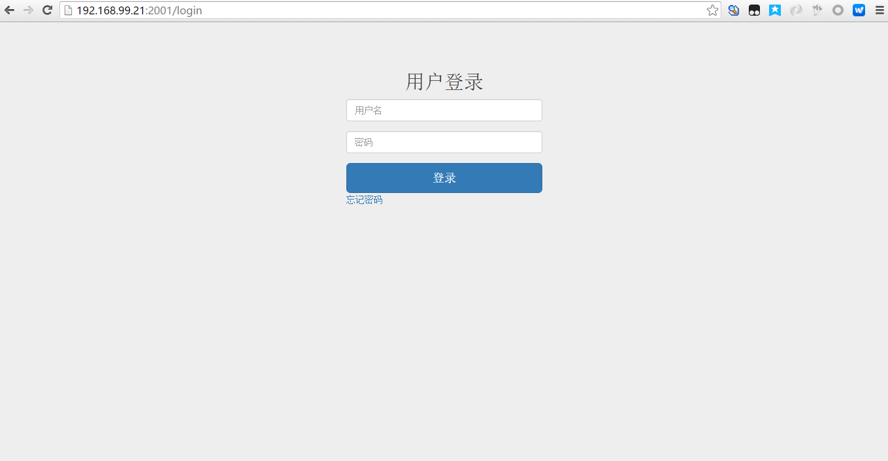
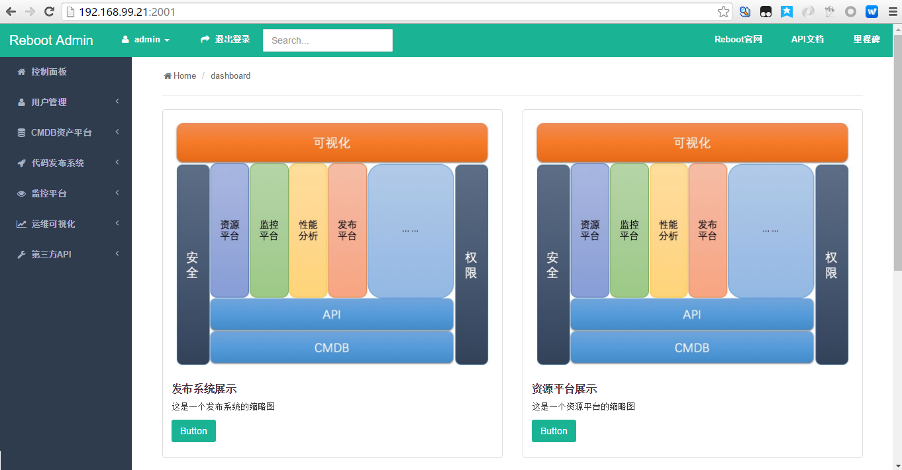
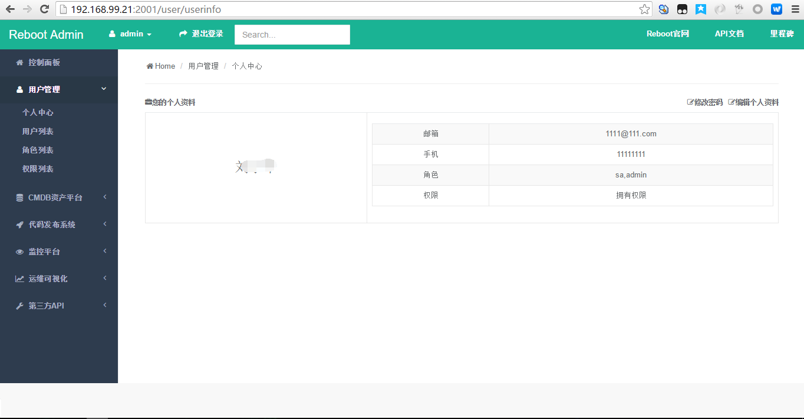

# 09-框架跑通及讲解
## 创建数据库
create database rb_opsdev CHARACTER SET utf8;
## 修改配置文件
+ /conf/service.conf
## 创建表导入测试数据 

```shell
(python27env) [vagrant@odweb-01 demo]$ cd /vagrant/
(python27env) [vagrant@odweb-01 vagrant]$ ls
api          conf   document               panda.sublime-workspace  requirement.txt  util.py       utils.pyc    web.tar.gz
api.tar.gz   db.py  log_test.py            readme.md                runapi.py        utils (2).py  Vagrantfile
api_test.py  demo   panda.sublime-project  reboot.sql               runweb.py        utils.py      web
(python27env) [vagrant@odweb-01 vagrant]$ mysql -uroot -proot1234
Welcome to the MySQL monitor.  Commands end with ; or \g.
Your MySQL connection id is 9
Server version: 5.1.73 Source distribution

Copyright (c) 2000, 2013, Oracle and/or its affiliates. All rights reserved.

Oracle is a registered trademark of Oracle Corporation and/or its
affiliates. Other names may be trademarks of their respective
owners.

Type 'help;' or '\h' for help. Type '\c' to clear the current input statement.

mysql> create database rb_opsdev CHARACTER SET utf8;
Query OK, 1 row affected (0.00 sec)

mysql> show databases;
+--------------------+
| Database           |
+--------------------+
| information_schema |
| mysql              |
| rb_opsdev          |
+--------------------+
3 rows in set (0.00 sec)

mysql> use rb_opsdev;
Database changed
mysql> source reboot.sql
Query OK, 0 rows affected (0.00 sec)

Query OK, 0 rows affected (0.00 sec)

Query OK, 0 rows affected (0.00 sec)

Query OK, 0 rows affected (0.00 sec)

Query OK, 0 rows affected (0.00 sec)

Query OK, 0 rows affected (0.00 sec)

Query OK, 0 rows affected (0.00 sec)

Query OK, 0 rows affected (0.00 sec)

Query OK, 0 rows affected (0.00 sec)

Query OK, 0 rows affected (0.00 sec)

Query OK, 0 rows affected (0.00 sec)

Query OK, 0 rows affected (0.00 sec)

Query OK, 0 rows affected (0.00 sec)

Query OK, 0 rows affected (0.03 sec)

Query OK, 0 rows affected (0.00 sec)

Query OK, 0 rows affected (0.00 sec)

Query OK, 0 rows affected (0.00 sec)

Query OK, 8 rows affected (0.00 sec)
Records: 8  Duplicates: 0  Warnings: 0

Query OK, 0 rows affected (0.00 sec)

Query OK, 0 rows affected (0.00 sec)

Query OK, 0 rows affected (0.00 sec)

Query OK, 0 rows affected (0.00 sec)

Query OK, 0 rows affected (0.00 sec)

Query OK, 0 rows affected (0.00 sec)

Query OK, 0 rows affected (0.00 sec)

Query OK, 0 rows affected (0.00 sec)

Query OK, 0 rows affected (0.00 sec)

Query OK, 6 rows affected (0.00 sec)
Records: 6  Duplicates: 0  Warnings: 0

Query OK, 0 rows affected (0.00 sec)

Query OK, 0 rows affected (0.00 sec)

Query OK, 0 rows affected (0.00 sec)

Query OK, 0 rows affected (0.00 sec)

Query OK, 0 rows affected (0.00 sec)

Query OK, 0 rows affected (0.01 sec)

Query OK, 0 rows affected (0.00 sec)

Query OK, 0 rows affected (0.00 sec)

Query OK, 0 rows affected (0.00 sec)

Query OK, 5 rows affected (0.00 sec)
Records: 5  Duplicates: 0  Warnings: 0

Query OK, 0 rows affected (0.00 sec)

Query OK, 0 rows affected (0.00 sec)

Query OK, 0 rows affected (0.00 sec)

Query OK, 0 rows affected (0.00 sec)

Query OK, 0 rows affected (0.00 sec)

Query OK, 0 rows affected (0.01 sec)

Query OK, 0 rows affected (0.00 sec)

Query OK, 0 rows affected (0.00 sec)

Query OK, 0 rows affected (0.00 sec)

Query OK, 68 rows affected (0.00 sec)
Records: 68  Duplicates: 0  Warnings: 0

Query OK, 0 rows affected (0.00 sec)

Query OK, 0 rows affected (0.00 sec)

Query OK, 0 rows affected (0.00 sec)

Query OK, 0 rows affected (0.00 sec)

Query OK, 0 rows affected (0.00 sec)

Query OK, 0 rows affected (0.01 sec)

Query OK, 0 rows affected (0.00 sec)

Query OK, 0 rows affected (0.00 sec)

Query OK, 0 rows affected (0.00 sec)

Query OK, 0 rows affected (0.00 sec)

Query OK, 0 rows affected (0.00 sec)

Query OK, 0 rows affected (0.00 sec)

Query OK, 0 rows affected (0.00 sec)

Query OK, 0 rows affected (0.00 sec)

Query OK, 0 rows affected (0.01 sec)

Query OK, 0 rows affected (0.00 sec)

Query OK, 0 rows affected (0.00 sec)

Query OK, 0 rows affected (0.00 sec)

Query OK, 5 rows affected (0.00 sec)
Records: 5  Duplicates: 0  Warnings: 0

Query OK, 0 rows affected (0.00 sec)

Query OK, 0 rows affected (0.00 sec)

Query OK, 0 rows affected (0.00 sec)

Query OK, 0 rows affected (0.00 sec)

Query OK, 0 rows affected (0.00 sec)

Query OK, 0 rows affected (0.00 sec)

Query OK, 0 rows affected (0.00 sec)

Query OK, 0 rows affected (0.00 sec)

Query OK, 0 rows affected (0.00 sec)

Query OK, 10 rows affected (0.01 sec)
Records: 10  Duplicates: 0  Warnings: 0

Query OK, 0 rows affected (0.00 sec)

Query OK, 0 rows affected (0.00 sec)

Query OK, 0 rows affected (0.00 sec)

Query OK, 0 rows affected (0.00 sec)

Query OK, 0 rows affected (0.00 sec)

Query OK, 0 rows affected (0.00 sec)

Query OK, 0 rows affected (0.00 sec)

Query OK, 0 rows affected (0.00 sec)

Query OK, 0 rows affected (0.00 sec)

Query OK, 0 rows affected (0.00 sec)

mysql> 
```

## 导入数据报错及其处理


```shell
(python27env) [vagrant@odweb-01 vagrant]$ mysql -uroot -proot1234
Welcome to the MySQL monitor.  Commands end with ; or \g.
Your MySQL connection id is 9
Server version: 5.1.73 Source distribution

Copyright (c) 2000, 2013, Oracle and/or its affiliates. All rights reserved.

Oracle is a registered trademark of Oracle Corporation and/or its
affiliates. Other names may be trademarks of their respective
owners.

Type 'help;' or '\h' for help. Type '\c' to clear the current input statement.

mysql> create database rb_opsdev CHARACTER SET utf8;
Query OK, 1 row affected (0.00 sec)

mysql> source reboot.sql
Query OK, 0 rows affected (0.00 sec)

Query OK, 0 rows affected (0.00 sec)

Query OK, 0 rows affected (0.00 sec)

Query OK, 0 rows affected (0.00 sec)

Query OK, 0 rows affected (0.00 sec)

Query OK, 0 rows affected (0.00 sec)

Query OK, 0 rows affected (0.00 sec)

Query OK, 0 rows affected (0.00 sec)

Query OK, 0 rows affected (0.00 sec)

Query OK, 0 rows affected (0.00 sec)

ERROR 1046 (3D000): No database selected
Query OK, 0 rows affected (0.00 sec)

Query OK, 0 rows affected (0.00 sec)

ERROR 1046 (3D000): No database selected
Query OK, 0 rows affected (0.00 sec)

ERROR 1046 (3D000): No database selected
ERROR 1046 (3D000): No database selected
ERROR 1046 (3D000): No database selected
ERROR 1046 (3D000): No database selected
Query OK, 0 rows affected (0.00 sec)

ERROR 1046 (3D000): No database selected
Query OK, 0 rows affected (0.00 sec)

Query OK, 0 rows affected (0.00 sec)

ERROR 1046 (3D000): No database selected
Query OK, 0 rows affected (0.00 sec)

ERROR 1046 (3D000): No database selected
ERROR 1046 (3D000): No database selected
ERROR 1046 (3D000): No database selected
ERROR 1046 (3D000): No database selected
Query OK, 0 rows affected (0.00 sec)

ERROR 1046 (3D000): No database selected
Query OK, 0 rows affected (0.00 sec)

Query OK, 0 rows affected (0.00 sec)

ERROR 1046 (3D000): No database selected
Query OK, 0 rows affected (0.00 sec)

ERROR 1046 (3D000): No database selected
ERROR 1046 (3D000): No database selected
ERROR 1046 (3D000): No database selected
ERROR 1046 (3D000): No database selected
Query OK, 0 rows affected (0.00 sec)

ERROR 1046 (3D000): No database selected
Query OK, 0 rows affected (0.00 sec)

Query OK, 0 rows affected (0.00 sec)

ERROR 1046 (3D000): No database selected
Query OK, 0 rows affected (0.00 sec)

ERROR 1046 (3D000): No database selected
ERROR 1046 (3D000): No database selected
ERROR 1046 (3D000): No database selected
ERROR 1046 (3D000): No database selected
Query OK, 0 rows affected (0.00 sec)

ERROR 1046 (3D000): No database selected
Query OK, 0 rows affected (0.00 sec)

Query OK, 0 rows affected (0.00 sec)

ERROR 1046 (3D000): No database selected
Query OK, 0 rows affected (0.00 sec)

ERROR 1046 (3D000): No database selected
ERROR 1046 (3D000): No database selected
ERROR 1046 (3D000): No database selected
Query OK, 0 rows affected (0.00 sec)

ERROR 1046 (3D000): No database selected
Query OK, 0 rows affected (0.00 sec)

Query OK, 0 rows affected (0.00 sec)

ERROR 1046 (3D000): No database selected
Query OK, 0 rows affected (0.00 sec)

ERROR 1046 (3D000): No database selected
ERROR 1046 (3D000): No database selected
ERROR 1046 (3D000): No database selected
ERROR 1046 (3D000): No database selected
Query OK, 0 rows affected (0.00 sec)

ERROR 1046 (3D000): No database selected
Query OK, 0 rows affected (0.00 sec)

Query OK, 0 rows affected (0.00 sec)

ERROR 1046 (3D000): No database selected
Query OK, 0 rows affected (0.00 sec)

ERROR 1046 (3D000): No database selected
ERROR 1046 (3D000): No database selected
ERROR 1046 (3D000): No database selected
ERROR 1046 (3D000): No database selected
Query OK, 0 rows affected (0.00 sec)

Query OK, 0 rows affected (0.00 sec)

Query OK, 0 rows affected (0.00 sec)

Query OK, 0 rows affected (0.00 sec)

Query OK, 0 rows affected (0.00 sec)

Query OK, 0 rows affected (0.00 sec)

Query OK, 0 rows affected (0.00 sec)

Query OK, 0 rows affected (0.00 sec)

Query OK, 0 rows affected (0.00 sec)

mysql> 
```
## 处理
+ drop db
+ create db
+ use db
+ source **.sql

```shell
mysql> show databases;
+--------------------+
| Database           |
+--------------------+
| information_schema |
| mysql              |
| rb_opsdev          |
+--------------------+
3 rows in set (0.00 sec)

mysql> drop database rb_opsdev;
Query OK, 0 rows affected (0.03 sec)

mysql> create database rb_opsdev CHARACTER SET utf8;
Query OK, 1 row affected (0.00 sec)

mysql> show databases;
+--------------------+
| Database           |
+--------------------+
| information_schema |
| mysql              |
| rb_opsdev          |
+--------------------+
3 rows in set (0.00 sec)

mysql> use rb_opsdev;
Database changed
mysql> source reboot.sql
```

# 运行
+ 启动web
    + python runweb.py
+ 启动api
    + python runapi.py
+ 访问
    + http://192.168.99.21:2001/
    + admin/123456
    + tail -f /var/log/web/web.log 
    + tail -f /var/log/api/api.log

## 运行截图

+ 20160729103517_登录
+ 20160729105037_首页
+ 20160729105154_用户管理_个人中心