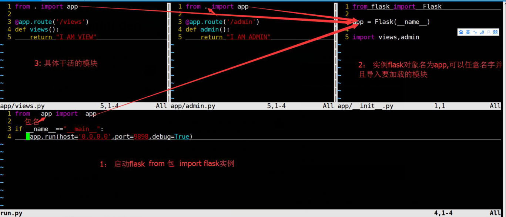

#flask mini demo
+ Flask的组织形式：
    + 包组织代码结构 //见本例
    + 蓝图 // 见rock老师的课程

## 代码清单
+ /demo/flaskdemo/run.py
+ /demo/flaskdemo/app/views.py
+ /demo/flaskdemo/app/admin.py

## flask工作原理
+ flask运行原理

## 运行
```shell
(python27env) [vagrant@odweb-01 flaskdemo]$ python run.py 
 * Running on http://0.0.0.0:9898/ (Press CTRL+C to quit)
 * Restarting with stat
 * Debugger is active!
 * Debugger pin code: 280-986-154
127.0.0.1 - - [27/Jul/2016 12:40:08] "GET /admin HTTP/1.1" 200 -
127.0.0.1 - - [27/Jul/2016 12:40:15] "GET /views HTTP/1.1" 200 -
```

### 报错和处理
+ 新环境未安装flask模块

```shell
(python27env) [vagrant@odweb-01 flaskdemo]$ python run.py 
Traceback (most recent call last):
  File "run.py", line 8, in <module>
    from app import app
ImportError: No module named app
(python27env) [vagrant@odweb-01 flaskdemo]$ python run.py 
Traceback (most recent call last):
  File "run.py", line 8, in <module>
    from app import app
  File "/vagrant/demo/flaskdemo/app/__init__.py", line 7, in <module>
    from flask import Flask
ImportError: No module named flask
(python27env) [vagrant@odweb-01 flaskdemo]$ pip list
elasticsearch (2.2.0)
MySQL-python (1.2.5)
pip (8.1.2)
requests (2.10.0)
setuptools (25.0.0)
urllib3 (1.16)
wheel (0.29.0)
(python27env) [vagrant@odweb-01 flaskdemo]$ pip install Flask

```
### 输出

```shell
(python27env) [vagrant@odweb-01 ~]$ curl 127.0.0.1:9898/admin
I AM admin!
(python27env) [vagrant@odweb-01 ~]$ curl 127.0.0.1:9898/views
I AM VIEWs!
(python27env) [vagrant@odweb-01 ~]$ 
```