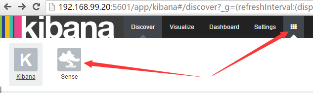
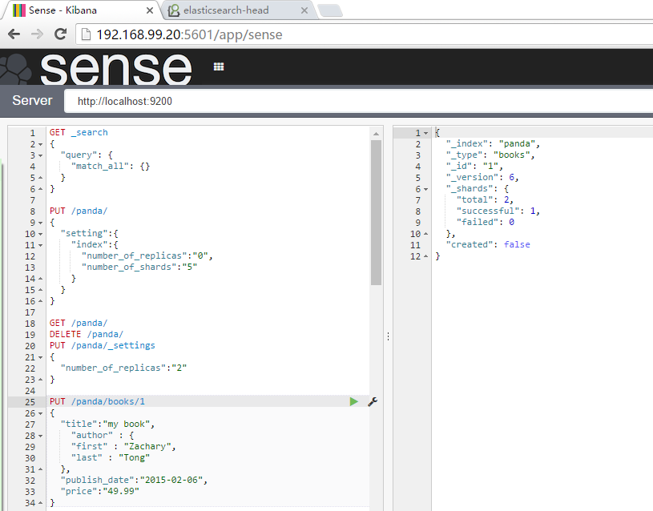
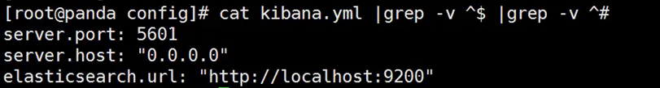
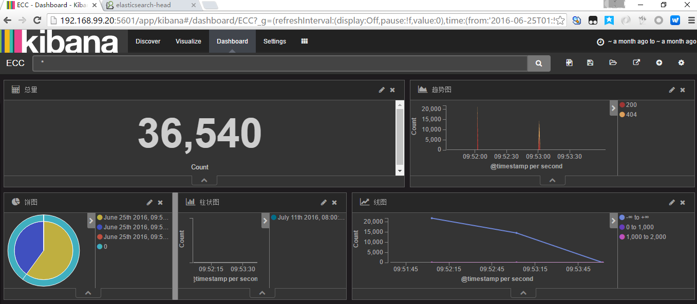

[TOC]
#kibana使用
kibana 是elasticsearch的web客户端，是一个分析和可视化elasticsearch平台，可通过kibana搜索、查看和存储在elasticsearch的索引进行交互。可以方便的执行先进的数据分析和可视化多种格式的数据，如图表、表格、地图等；
##kibana 插件管理
+ 安装：bin/kibana plugin --install <org>/<package>/<version>
+ 删除：bin/kibana plugin --remove plugin_name

### 安装sense插件（request：kinaba4.2 +）
测试 验证 API调用

```shell
./bin/kibana plugin --install elastic/sense
./bin/kibana plugin --i elasticsearch/marvel/latest
```

+ kibana_sense
+ kibana_sense_api
## es数据如何到 kibana展示+ kibana_sense

配置kibana的配置文件，指定es的参数即可，kibana即可自动识别已有索引，Create即可
20160720213923_kibana.yml

##kibana四大模块
+ setting：匹配和加载索引数据
    + 要使用kibana，得先告诉kibana要搜索的elasticsearch索引是哪些，可以配置一个或多个索引
        + 从浏览器访问kibana界面选择Setting选项（第一次打开默认就是Setting界面）
        + 指定一个可以匹配一个或多个Elasticsearch索引的index pattern；默认情况下，kibana会认为你要访问的是通过Logstash导入elasticsearch的数据。
        + 默认为 logstash-*
    + 选择一个包含了时间戳的索引字段，可以用来做基于时间的处理。Kibana会读取索引的映射，然后列出所有包含了时间戳的字段
    + Use event times to Create index names
    + 点击 create，添加 index pattenr；
        + 第一个被添加的pattern会被自动设置为默认值
        + 可以在Setting-->Indices里设置具体哪个是默认值
+ kibana时间设置
    + 会根据浏览器判断当前的时区
    + 修改默认时区 Setting --> Advanced --> dataFormat：tz 
+ Visualize页面：自定义图表
    + 通常使用time相关字段作为x轴坐标
+ dashbard页面：展示图表
20160720223252_kibana_dashboard
