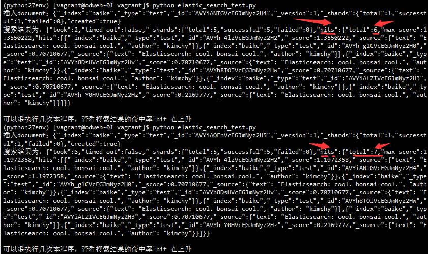

[TOC]
# 03-es的api使用
## 不使用API的例子 
详见 目录下 elastic_search_test.py 
### 执行结果
20160725202254_命中率在上升

### 执行报错和处理
#### 报错：命令行拼接中文报错

```shell
(python27env) [vagrant@odweb-01 vagrant]$ python elastic_search_test.py 
Traceback (most recent call last):
  File "elastic_search_test.py", line 20, in <module>
    print "插入document：" + r.text
UnicodeDecodeError: 'ascii' codec can't decode byte 0xe6 in position 0: ordinal not in range(128)
```

#### 处理：加上自定义编码文件
```shell
(python27env) [vagrant@odweb-01 vagrant]$ cd /data/python27env/lib/python2.7
(python27env) [vagrant@odweb-01 python2.7]$ vi sitecustomize.py
(python27env) [vagrant@odweb-01 python2.7]$ more sitecustomize.py 
import sys
sys.setdefaultencoding('utf-8')
(python27env) [vagrant@odweb-01 python2.7]$ source /data/python27env/bin/activate
```
## 使用ES API
### 安装插件
(python27env) [vagrant@odweb-01 vagrant]$ pip install elasticsearch==2.2.0

详见 目录下 elastic_search_api_test.py 
### 输出
```shell
(python27env) [vagrant@odweb-01 vagrant]$ python elastic_search_api_test.py 
True
Got 3 Hits:
2016-07-25T20:56:31.711593 kimchy: Elasticsearch: cool. bonsai cool.
2016-07-25T20:57:08.157363 kimchy: Elasticsearch: cool. bonsai cool.
2016-07-25T20:58:26.422977 kimchy: Elasticsearch: cool. bonsai cool.
```

